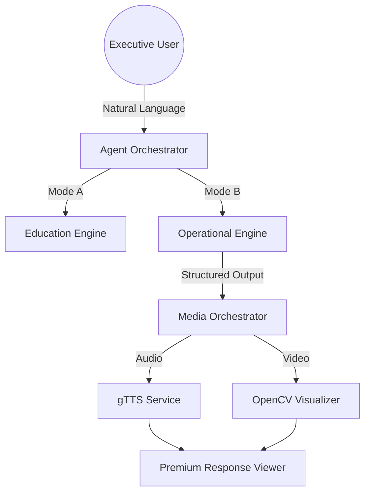

#  CyberRant V-Labs: Enterprise Intelligence Gateway

<div align="center">

[](https://cyberrant.onrender.com/)
[](https://github.com/google-deepmind)
[](LICENSE)

**A calm, executive-grade AI orchestration platform for risk calibration and conceptual security intelligence.**

---

[Explore The Gateway](https://cyberrant.onrender.com/) • [Documentation](#-core-architecture) • [Security Policy](#-governance--safety)

</div>

## 🌌 Overview

CyberRant V-Labs is not just an AI assistant; it is a **Governing Intelligence Layer** designed to transform complex cyber threats into clear, actionable, and executive-ready intelligence. Built on the **Antigravity Framework**, it prioritizes stability, trust, and human-centric risk management.

### 🎭 Dual-Mode Intel Dispatch
The system automatically determines the operational mode based on natural language intent:

*   **🎓 Mode A: Ask Rant AI (Learning/Awareness)**
    *   Designed for non-technical stakeholders and beginners.
    *   Suppresses technical jargon, CVEs, and tool names.
    *   Focuses on "Why It Matters" and "High-Level Defense".
*   **🛡️ Mode B: Rant AI Agent (Operational/SOC)**
    *   Auto-calculates severity based on asset criticality and signal strength.
    *   Generates structured SOC-grade incident reports.
    *   Enforces Human-in-the-Loop (HITL) for all high-risk actions.

---

## ✨ Key Features

- **🎬 Multimodal Synchronization**: Automatic generation of audio briefings and video visual summaries synced with threat severity.
- **🧠 Auto-Severity Tuning**: A proprietary engine that normalizes risk to prevent both over-reaction and under-reaction.
- **🚫 Zero-Trust Hardening**: Internal suppression of AI "reasoning" or tool-use details—providing only the finalized intelligence.
- **🎨 Premium UX**: A glassmorphic, high-fidelity interface designed for modern Security Operations Centers.

---

## 🛠 Tech Stack

| Backend (Hardened) | Frontend (Premium) | Infrastructure |
| :--- | :--- | :--- |
| Fast API v0.109+ | React v18+ | Docker Production-Ready |
| OpenAI Trinity | Tailwind CSS / Framer Motion | Render Auto-Deploy |
| gTTS / OpenCV-Headless | Remark GFM / Responsive Layout | Git Managed |

---

## 🚀 Getting Started

### Prerequisites
- Python 3.11+
- Node.js 20+
- OpenRouter API Key

### Installation

1. **Clone the Gateway**
   ```bash
   git clone https://github.com/Chrishabh2002/CyberRant.git
   cd CyberRant
   ```

2. **Configure Environment**
   Create a `.env` in `backend/` and `frontend/`:
   ```bash
   # backend/.env
   OPENROUTER_API_KEY=your_key_here
   ```

3. **Deploy via Docker** (Recommended)
   ```bash
   docker build -t cyberrant-gateway .
   docker run -p 8000:8000 cyberrant-gateway
   ```

---

## 🏛 Core Architecture



---

## 🛡 Governance & Safety

CyberRant V-Labs operates under the **Antigravity v3.1** ruleset:
- **No Attacker Perspective**: The system never generates exploit code or payloads.
- **Safety Redirection**: Malicious intent is redirected to conceptual prevention training.
- **Calm Tone**: No flashing red lights or alarmist language—only calibrated risk assessment.

---

<div align="center">
  <sub>Built by <a href="https://github.com/Chrishabh2002">Chrishabh2002</a> with ❤️ for the Security Community.</sub><br/>
  <sup>CyberRant V-Labs is part of the Future SOC Initiative.</sup>
</div>
